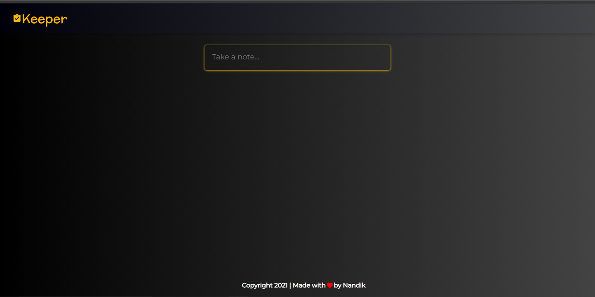
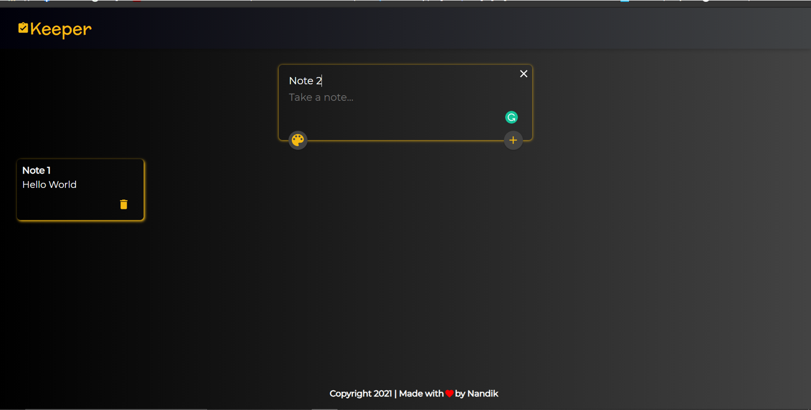
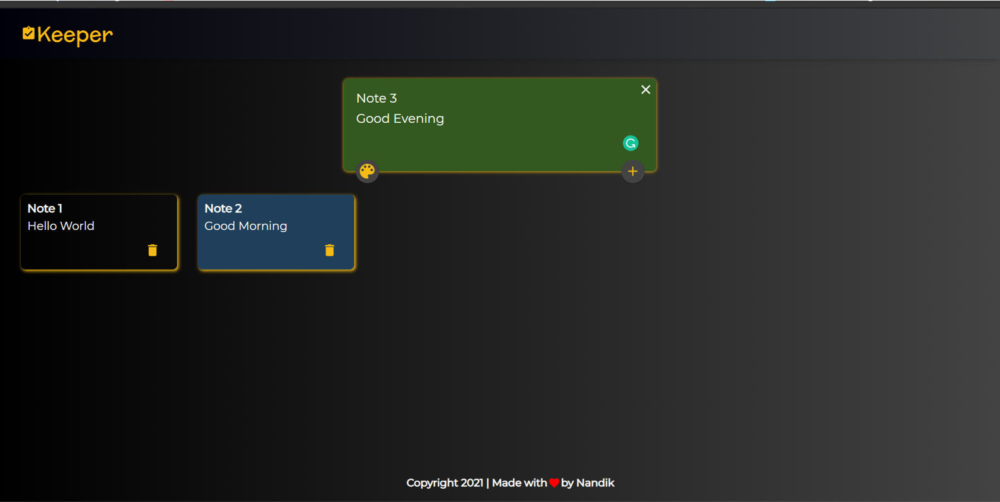

# Keeper App

   This is the version 1 of cloning Google Keep app.  
     
    Basic features of adding note, changing color of notes and making the app reactive is provided in this version.
     
    The app is built on HTML5, ,Javascript, ES-6, CSS3 and React. 
     
    Cheers!!!

    
    
    

